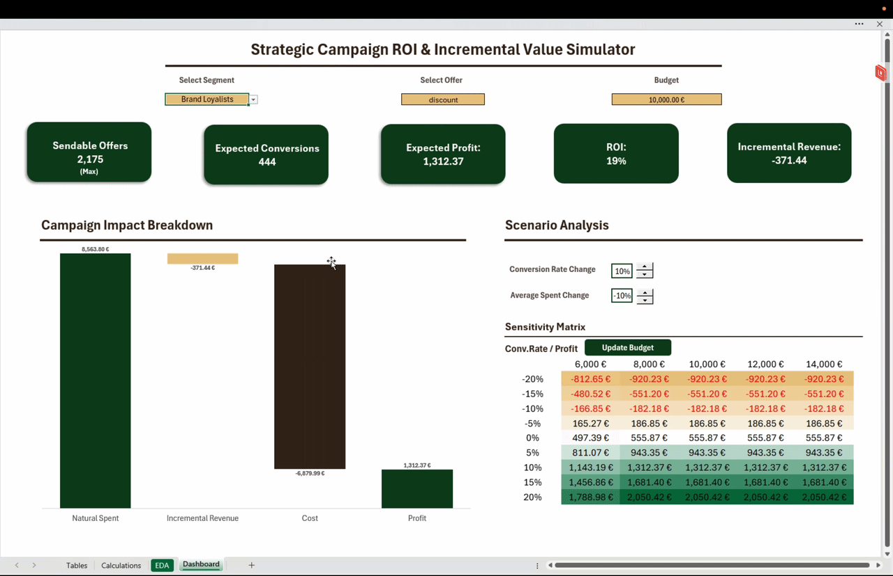

# Strategic Campaign ROI & Incremental Value Simulator

## Summary

In retail, high sales numbers during a promotion can be misleading. Sending discounts to every customer often hurts profitability simply because many people would have bought their coffee anyway at full price.

Using the [Starbucks Rewards](https://www.kaggle.com/datasets/blacktile/starbucks-app-customer-reward-program-data) dataset, this project builds a decision model to verify if a promotion generates real extra revenue. By separating natural customer spending from promo-driven spending, the tool helps to identify which campaigns truly drive profit and which ones just waste marketing budget. 


---

## 📁 Repository Structure

```text
├── Images/            # Visual assets in this documentation
├── Workbook/            # The final Simulation Engine and Executive Dashboard
├── Data/              # Core datasets powering the analysis
│   ├── raw_json/      # Original, unprocessed nested system logs
│   ├── raw_csv/       # Flattened files (includes portfolio.csv)
│   └── processed/     # Engineered files (includes enriched transcript.csv & profile.csv)
└── Scripts/           # Python pipelines for ETL and feature engineering
    ├── json_to_csv.py # Flattens nested arrays/dictionaries into relational schemas
    └── add_columns.py # DuckDB SQL script for causal tracking and counterfactual metrics

```

---

## Technical Workflow & Business Logic

### Phase 1: Data Cleaning & Preparation (Python / Pandas)

The raw dataset contained nested JSON fields that were difficult to analyze directly. Using Python, the data was cleaned and organized into flat tables:

* **Channel Flags:** Expanded the nested `channels` list (email, mobile, social, web) into separate 0/1 indicator columns for easy filtering.
* **Extracting Transaction Details:** Unnested the `value` dictionary in the logs to create clear, dedicated columns for `offer_id`, transaction `amount`, and `reward`.

### Phase 2: Tracking Offer Impact & Baseline Spending (SQL / DuckDB)

Using DuckDB, the transaction history was reconstructed to measure true customer responsiveness and separate natural spending from promo spending:

* **Validating Conversions:** Used SQL window functions (`PARTITION BY person, "offer id" ORDER BY time`) to track the exact timeline. An offer is only marked as a conversion if the customer received it, viewed it, and made a qualifying purchase before it expired.
* **Natural Baseline Spending:** Flagged transactions made outside active promo windows to calculate what each customer spends normally without an incentive.
* **Customer Metrics:** Added two core metrics to each customer profile: promotional responsiveness and average natural spend. Removed placeholder/corrupt records (such as accounts with age 118).

### Phase 3: Customer Segmentation

Divided the customer base into four clear groups based on their median natural spend and responsiveness to offers:

1. **Brand Loyalists** (High spend, low responsiveness): Buy regularly at full price. Sending them discounts wastes budget because they would purchase anyway.
2. **Deal Hunters** (High spend, high responsiveness): High-value customers who react strongly to promotions. They generate the highest profit and ROI, especially with discount offers.
3. **Promo-Driven** (Low spend, high responsiveness): Rarely buy on their own, but convert quickly when offered a promotion. Prime target for generating new sales.
4. **Occasionals** (Low spend, low responsiveness): Low-spending buyers who rarely react to discounts. Best engaged with low-cost informational reminders.

### Phase 4: Campaign Simulation Model (Excel & Power Pivot)

Built an interactive simulation model in Excel connected to the Power Pivot data model:

* **Dynamic Data Links:** Used `CUBEVALUE` functions to pull segment conversion rates and baseline metrics directly from the data model based on selected inputs.
* **Audience & Budget Limits:** Calculated the actual number of sendable offers based on the available marketing budget and the size of the selected customer segment.
* **Real Profit Calculation:** Evaluated campaign value by comparing promotional revenue against both the reward costs and the customer's natural baseline spend.

### Phase 5: Interactive Dashboard

A clean Excel front end for testing scenarios and assessing campaign performance:

* **KPI Summary Cards:** Real-time metrics for Expected Profit, Conversions, ROAS, and Incremental Revenue that update with dropdown filters (Segment, Offer Type, Budget).
* **Waterfall Chart:** A visual P&L bridge showing natural baseline spend, extra revenue generated by the promo, reward costs, and final profit.
* **Sensitivity Matrix:** A 2-variable Data Table testing conversion rates against different budgets to show where campaigns remain profitable.

